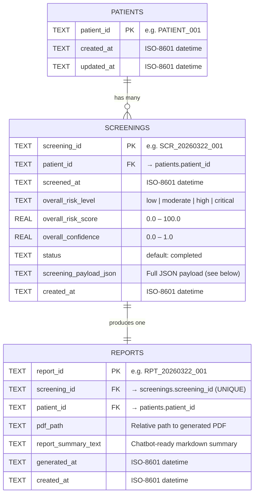
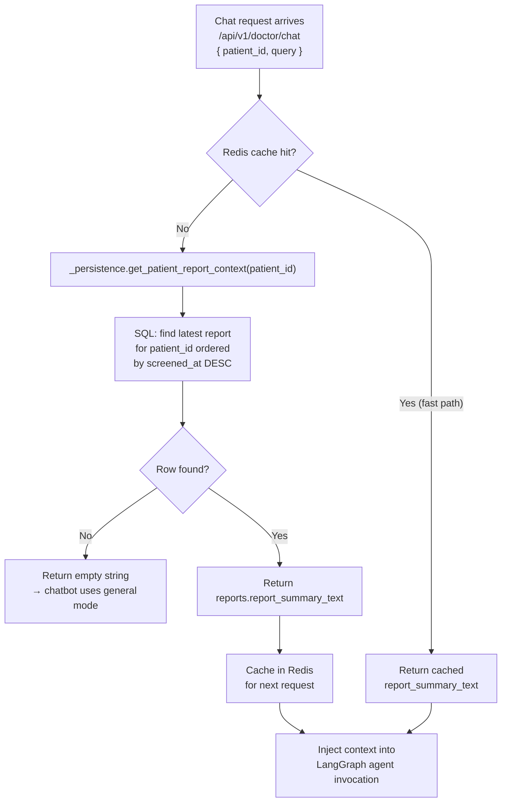

# Chiranjeevi — Database Schema Reference

> **Engine**: SQLite (file-backed, thread-safe via `threading.Lock`)
> **Service**: `fastapi2/app/services/persistence.py` — `PersistenceService`
> **Initialized at**: FastAPI startup via `_persistence.init_db()`
> **Database URL**: Configured in `settings.database_url` (`fastapi2/app/config.py`)

---

## Entity-Relationship Diagram



---

## Table Definitions

### `patients`

Minimal identity anchor. Created automatically the first time a patient ID is seen in a screening or report.

| Column | Type | Constraint | Notes |
|---|---|---|---|
| `patient_id` | TEXT | `PRIMARY KEY` | Exact string used by hardware/frontend (case-insensitive lookups) |
| `created_at` | TEXT | `NOT NULL` | ISO-8601 — first seen timestamp |
| `updated_at` | TEXT | `NOT NULL` | ISO-8601 — updated on every upsert |

**Upsert behaviour**: `ON CONFLICT(patient_id) DO UPDATE SET updated_at=excluded.updated_at`
→ safe to call `create_or_get_patient()` on every screening without duplicates.

---

### `screenings`

One row per completed hardware screening run. Stores the full clinical payload as JSON so reports and chatbot context can be regenerated from SQL without process-level memory.

| Column | Type | Constraint | Notes |
|---|---|---|---|
| `screening_id` | TEXT | `PRIMARY KEY` | UUIDv4 generated by `ScreeningService` |
| `patient_id` | TEXT | `NOT NULL`, FK | Must exist in `patients` (FK enforced) |
| `screened_at` | TEXT | `NOT NULL` | Timestamp of the hardware capture |
| `overall_risk_level` | TEXT | `NOT NULL` | `low` / `moderate` / `high` / `critical` |
| `overall_risk_score` | REAL | `NOT NULL` | 0–100 composite score |
| `overall_confidence` | REAL | `NOT NULL` | 0.0–1.0 trust-weighted confidence |
| `status` | TEXT | `NOT NULL DEFAULT 'completed'` | Currently always `completed` |
| `screening_payload_json` | TEXT | `NOT NULL` | JSON blob — see payload schema below |
| `created_at` | TEXT | `NOT NULL` | Row insert timestamp |

#### `screening_payload_json` inner structure

```json
{
  "screening_id": "...",
  "patient_id": "...",
  "timestamp": "ISO-8601",
  "overall_risk_level": "moderate",
  "overall_risk_score": 62.4,
  "overall_confidence": 0.87,
  "system_results": [ "...rendered response objects..." ],
  "system_results_internal": { "cardiovascular": { "overall_risk": {}, "sub_risks": [], "biomarker_summary": {}, "alerts": [] }, "..." : {} },
  "trusted_results": { "cardiovascular": { "risk_result": {}, "is_trusted": true, "was_rejected": false, "rejection_reason": "", "trust_adjusted_confidence": 0.9, "caveats": [] } },
  "composite_risk": { "name": "overall", "score": 62.4, "confidence": 0.87, "contributing_biomarkers": [], "explanation": "..." },
  "rejected_systems": [],
  "trust_metadata": {},
  "validation_status": {},
  "requires_review": false,
  "clinical_findings": [],
  "clinical_summary": {}
}
```

---

### `reports`

One row per generated PDF report. One-to-one with screenings (enforced via `UNIQUE` on `screening_id`).
The `report_summary_text` column is the **single source of truth** for chatbot context.

| Column | Type | Constraint | Notes |
|---|---|---|---|
| `report_id` | TEXT | `PRIMARY KEY` | Set by `PatientReportGenerator` |
| `screening_id` | TEXT | `NOT NULL UNIQUE`, FK | Enforces one report per screening |
| `patient_id` | TEXT | `NOT NULL`, FK | Denormalized for fast patient lookups |
| `pdf_path` | TEXT | `NOT NULL` | Relative path, e.g. `reports/PR-20260322-001.pdf` |
| `report_summary_text` | TEXT | `NOT NULL` | Markdown formatted chatbot-ready summary |
| `generated_at` | TEXT | `NOT NULL` | Report generation timestamp |
| `created_at` | TEXT | `NOT NULL` | Row insert timestamp |

**Upsert behaviour**: `ON CONFLICT(screening_id) DO UPDATE SET ...`
→ re-generating a report for the same screening safely overwrites the old row.

---

## Indexes

| Index Name | Table | Columns | Purpose |
|---|---|---|---|
| `idx_screenings_patient_screened_at` | `screenings` | `(patient_id, screened_at DESC)` | Fast "latest screening for patient" lookup |
| `idx_reports_patient_generated_at` | `reports` | `(patient_id, generated_at DESC)` | Fast "latest report for patient" lookup |

---

## Constraints Summary

| Constraint | Effect |
|---|---|
| `PRAGMA foreign_keys = ON` | FK violations raise errors at write time |
| `reports.screening_id UNIQUE` | Exactly one report per screening — no duplicates |
| `reports.patient_id` must match screening's patient | Enforced at application layer in `save_report()` |
| Case-insensitive patient lookup | `lower(patient_id) = lower(?)` used in all lookup queries |

---

## Chatbot Context Lookup Flow

This is the runtime path taken every time the chatbot needs patient context:



### Implementation in code

```python
# fastapi2/app/main.py

def _load_patient_report_context(patient_id: str) -> str:
    # 1. Redis fast path
    cached = redis_client.get_screening_context(patient_id)
    if cached:
        return cached

    # 2. SQLite fallback
    context_md = _persistence.get_patient_report_context(patient_id)
    if not context_md:
        return ""  # → agent runs in general mode

    # 3. Warm Redis for next request
    redis_client.cache_screening_context(patient_id, context_md)
    return context_md
```

### When is context invalidated?

| Event | Action |
|---|---|
| New screening saved | `redis_client.invalidate_screening_context(patient_id)` — forces next chat to refresh from SQL |
| New report generated | `redis_client.cache_screening_context(patient_id, report_summary_text)` — immediately warms cache with new summary |

---

## Repository Method Reference

| Method | Description |
|---|---|
| `create_or_get_patient(patient_id)` | Upsert patient row, safe to call multiple times |
| `save_screening(result, extra_payload)` | Persist full screening result; auto-creates patient |
| `get_screening_by_id(screening_id)` | Fetch + deserialize one screening (with typed Python objects) |
| `get_latest_screening_by_patient(patient_id)` | Fetch most recent screening for a patient |
| `save_report(screening_id, patient_id, ...)` | Persist report row; upserts on conflict |
| `get_report_by_id(report_id)` | Fetch one report as dict |
| `get_latest_report_by_patient(patient_id)` | Fetch most recent report (joined through screenings for correct ordering) |
| `get_patient_report_context(patient_id)` | Returns `report_summary_text` string directly — used by chatbot |

---

## Worked Example

### 1. Patient walks in, screening runs

```
patients:
  patient_id = "PATIENT_001"

screenings:
  screening_id        = "SCR-20260322-abc123"
  patient_id          = "PATIENT_001"
  screened_at         = "2026-03-22T14:30:00"
  overall_risk_level  = "moderate"
  overall_risk_score  = 54.2
  overall_confidence  = 0.91
  status              = "completed"
  screening_payload_json = { full clinical payload }
```

### 2. Report is generated

```
reports:
  report_id            = "RPT-20260322-xyz789"
  screening_id         = "SCR-20260322-abc123"
  patient_id           = "PATIENT_001"
  pdf_path             = "reports/PR-20260322-001.pdf"
  report_summary_text  = "## Patient Screening Report - 22 Mar 2026, 02:30 PM
                          - Patient ID: PATIENT_001
                          - Overall Risk: MODERATE (score 54.2/100, confidence 91%)
                          ### System Highlights
                          - Cardiovascular: MODERATE
                            - Elevated resting HR: 94 bpm
                          ..."
  generated_at         = "2026-03-22T14:35:00"
```

### 3. Patient chats — context injected

```
GET Redis["PATIENT_001"] → miss
→ SQL: get_patient_report_context("PATIENT_001")
→ returns report_summary_text from reports table
→ Redis["PATIENT_001"] = <summary>
→ LangGraph agent receives patient_context=<summary>
```

---

## What Is NOT Stored Here

| Data | Where it lives |
|---|---|
| Full chat transcript | LangGraph in-memory (not persisted in v1) |
| Runtime conversation memory | LangGraph `MemorySaver` keyed by `patient_id` (in-process) |
| General Q&A by guest users | Not persisted anywhere |
| Raw camera / radar / sensor frames | Not persisted (processed then discarded) |
