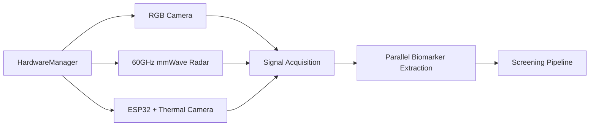
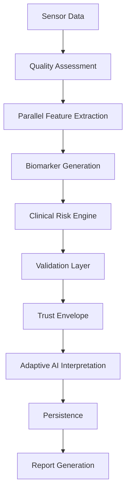
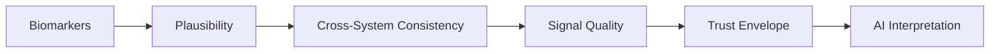
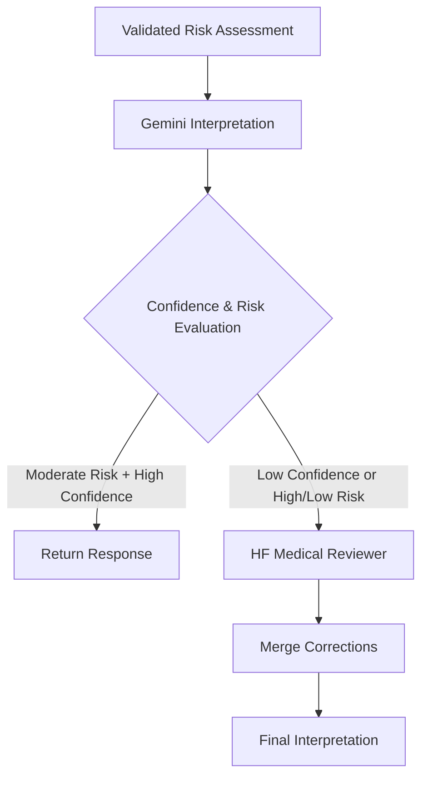
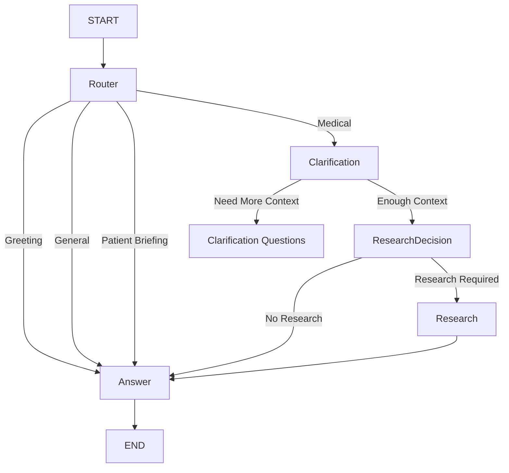

# 🏥 Chiranjeevi
### Autonomous Multimodal Physiological Screening & AI Medical Assistant

[]()
[]()
[]()
[]()

> **Reimagining preventive healthcare through passive sensing, multimodal physiological analysis, and AI-assisted medical reasoning.**

---

# 📖 Table of Contents

- [Overview](#overview)
- [Why Chiranjeevi?](#why-chiranjeevi)
- [Features](#features)
- [System Architecture](#system-architecture)
- [Adaptive AI Interpretation](#adaptive-ai-interpretation)
- [Technology Stack](#technology-stack)
- [Project Structure](#project-structure)
- [Getting Started](#getting-started)
- [Environment Variables](#environment-variables)
- [Running the Backend](#running-the-backend)
- [API Overview](#api-overview)
- [Supported Physiological Systems](#supported-physiological-systems)
- [Privacy & Data Handling](#privacy-data-handling)
- [Disclaimer](#disclaimer)
- [Internal Architecture](#internal-architecture)
- [Hardware Architecture](#hardware-architecture)
- [Physiological Screening Pipeline](#physiological-screening-pipeline)
- [Clinical Validation Layer](#clinical-validation-layer)
- [Adaptive Multi-LLM Interpretation](#adaptive-multi-llm-interpretation-2)
- [LangGraph Medical AI Agent](#langgraph-medical-ai-agent)
- [Report Generation](#report-generation)
- [Persistence Layer](#persistence-layer)
- [Performance Optimizations (Architecture)](#performance-optimizations-1)
- [Privacy & Security](#privacy-security)
- [External Integrations](#external-integrations)
- [Performance Optimizations (Backend)](#performance-optimizations-2)
- [Scientific Foundation](#scientific-foundation)
- [References](#references)
- [Contributing](#contributing)
- [Roadmap](#roadmap)
- [Frequently Asked Questions](#faq)
- [License](#license)
- [Vision](#vision)

---

<a id="overview"></a>
# 📖 Overview

**Chiranjeevi** is an AI-powered multimodal physiological screening platform designed to assist preventive healthcare through passive sensing and intelligent medical interpretation.

The platform combines deterministic physiological analysis with modern AI to estimate health indicators using multiple non-invasive sensing modalities including RGB imaging, thermal imaging, and mmWave radar.

Unlike conventional diagnostic systems that rely entirely on manual measurements, Chiranjeevi automates the workflow from physiological signal acquisition to AI-assisted interpretation and report generation.

The repository contains the complete backend responsible for:

- Multimodal physiological screening
- Sensor orchestration
- Biomarker extraction
- Risk analysis
- Adaptive AI interpretation
- PDF report generation
- LangGraph-powered doctor assistant
- Hardware management
- REST APIs

> ⚠️ **Research & Educational Use Only**  
> Chiranjeevi is intended as an AI-assisted screening platform and **does not replace professional medical diagnosis or treatment.**

---

<a id="why-chiranjeevi"></a>
# 💡 Why Chiranjeevi?

Healthcare today is largely reactive—patients typically seek medical attention only after symptoms become noticeable.

Chiranjeevi explores a different approach by combining passive sensing, deterministic algorithms, and AI-assisted reasoning to help identify potential physiological abnormalities earlier in the screening process.

The platform is built around four guiding principles:

- **Passive, non-invasive physiological screening**
- **Privacy-first architecture**
- **Evidence-assisted medical reasoning**
- **Modular and scalable backend design**

Rather than replacing clinicians, Chiranjeevi aims to provide an intelligent screening layer that assists both patients and healthcare professionals.

---

<a id="features"></a>
# ✨ Features

## 🩺 Physiological Screening

- Passive multimodal physiological screening
- Non-contact health assessment
- Modular biomarker extraction
- Risk scoring across multiple body systems
- Data quality validation before inference

---

## 🤖 AI-Assisted Interpretation

- Adaptive multi-LLM interpretation pipeline
- LangGraph-based conversational medical assistant
- Patient-context aware responses
- Intelligent clarification before answering
- Optional medical literature retrieval (PubMed + Tavily)

---

## 📡 Hardware Integration

Supports multiple sensing modalities including:

- RGB Camera
- Thermal Camera (ESP32 + MLX90640)
- 60GHz mmWave Radar

Hardware is orchestrated through the backend `HardwareManager`, allowing synchronized data collection and processing.

---

## 📄 Report Generation

- Automated patient report generation
- QR-based report download
- Structured physiological summaries
- AI-generated screening interpretation

---

## ⚡ Backend Services

- FastAPI REST APIs
- Streaming responses
- SQLite persistence
- Optional Redis caching
- Modular service architecture

---

<a id="system-architecture"></a>
# 🏗️ System Architecture

```text
                 Patient
                    │
                    ▼
          HardwareManager
                    │
                    ▼
     Signal Acquisition Layer
(Camera • Thermal • mmWave Radar)
                    │
                    ▼
        Biomarker Extraction
                    │
                    ▼
          Risk Computation
                    │
                    ▼
 Validation Layer
(Plausibility + Consistency + Trust Envelope)
                    │
                    ▼
 Adaptive AI Interpretation
      (Gemini → HF Reviewer*)
                    │
                    ▼
      SQLite / Redis Storage
                    │
        ┌───────────┴───────────┐
        ▼                       ▼
 Patient Report          Doctor Chat API
```

> *The Hugging Face medical reviewer is invoked only when additional validation is required.*

---

<a id="adaptive-ai-interpretation"></a>
# 🧠 Adaptive AI Interpretation

The active screening interpretation pipeline is implemented in:

```
fastapi2/app/core/llm/multi_llm_interpreter.py
```

Instead of always using multiple language models, Chiranjeevi employs an adaptive workflow to balance response quality with inference speed.

### Phase 1 — Gemini

Gemini generates the primary structured interpretation of the physiological screening results.

For moderate-risk cases with high confidence, this response is used directly.

---

### Phase 2 — Medical Reviewer

When confidence is low or the patient's risk profile requires additional verification, a Hugging Face medical model performs an independent review and correction before the final interpretation is returned.

This adaptive approach minimizes latency while providing additional validation for complex cases.

---

<a id="technology-stack"></a>
# 💻 Technology Stack

## Backend

- FastAPI
- Python 3.11+
- Pydantic
- SQLAlchemy

---

## AI & Machine Learning

- LangGraph
- LangChain
- Google Gemini
- Hugging Face Inference API

---

## Computer Vision & Signal Processing

- OpenCV
- MediaPipe
- NumPy
- SciPy

---

## Medical Research

- PubMed
- Tavily Search

---

## Reports

- ReportLab

---

## Database & Cache

- SQLite
- Redis (Optional)

---

## Hardware

- ESP32
- MLX90640 Thermal Camera
- 60GHz mmWave Radar
- RGB Camera

---

<a id="project-structure"></a>
# 📂 Project Structure

```text
techgium/
│
├── fastapi2/
│   ├── app/
│   │   ├── api/                  # REST API routes
│   │   ├── core/
│   │   │   ├── extraction/       # Biomarker extraction
│   │   │   ├── inference/        # Risk computation
│   │   │   ├── validation/       # Trust Envelope & quality validation
│   │   │   ├── llm/              # Adaptive screening interpreter
│   │   │   ├── reports/          # PDF generation
│   │   │   ├── hardware/         # Hardware orchestration
│   │   │   └── agents/
│   │   │
│   │   ├── models/
│   │   ├── services/
│   │   ├── utils/
│   │   ├── config.py
│   │   └── main.py
│   │
│   ├── agent/                    # LangGraph Doctor Assistant
│   ├── tests/
│   └── requirements.txt
│
├── frontend/
├── mobile/
└── README.md
```

The project follows a modular architecture where hardware integration, AI interpretation, report generation, and API services remain independently extensible.

---

<a id="getting-started"></a>
# 🚀 Getting Started

## Prerequisites

- Python 3.11+
- pip
- Virtual Environment

Optional:

- Redis
- Camera
- mmWave Radar
- ESP32 Thermal Camera

---

## Installation

Clone the repository.

```bash
git clone https://github.com/<your-org>/techgium.git

cd techgium/fastapi2
```

Create a virtual environment.

```bash
python -m venv .venv
```

Linux/macOS

```bash
source .venv/bin/activate
```

Windows

```powershell
.venv\Scripts\activate
```

Install dependencies.

```bash
pip install -r requirements.txt
```

---

<a id="environment-variables"></a>
# 🔑 Environment Variables

Create a `.env` file inside `fastapi2/`.

| Variable | Required | Purpose |
|----------|----------|----------|
| `HF_TOKEN` | Recommended | Hugging Face medical reviewer |
| `GEMINI_API_KEY` or `GOOGLE_API_KEY` | Recommended | Gemini interpretation |
| `TAVILY_API_KEY` | Optional | Web research |
| `NCBI_API_KEY` | Optional | PubMed |
| `SARVAM_API_KEY` | Optional | Translation & TTS |
| `REDIS_URL` | Optional | Redis caching |
| `RADAR_PORT` | Optional | Radar serial port |
| `ESP32_PORT` | Optional | Thermal sensor serial port |

> The backend includes mock/fallback behavior for some AI services during development, but production deployments should provide the appropriate API keys.

---

<a id="running-the-backend"></a>
# ▶️ Running the Backend

Start the FastAPI server:

```bash
cd fastapi2

uvicorn app.main:app --reload
```

The backend will be available at:

```
http://localhost:8000
```

Swagger Documentation:

```
http://localhost:8000/docs
```

---

<a id="api-overview"></a>
# 🌐 API Overview

## Health

```
GET /
GET /health
```

---

## Screening

```
POST /api/v1/screening
GET  /api/v1/screening/{screening_id}
```

---

## Reports

```
POST /api/v1/reports/generate
GET  /api/v1/reports/{report_id}/download
GET  /api/v1/reports/{report_id}/qr
```

---

## Hardware

```
GET  /api/v1/hardware/status
POST /api/v1/hardware/start-screening
GET  /api/v1/hardware/scan-status
POST /api/v1/hardware/calibrate
GET  /api/v1/hardware/calibrate/status
GET  /api/v1/hardware/sensor-status
GET  /api/v1/hardware/calibration-check
GET  /api/v1/hardware/video-feed
```

---

## Doctor Assistant

```
POST /api/v1/doctor/chat
```

Supports:

- Streaming responses
- Patient context injection
- Optional PubMed + Tavily research
- Translation and text-to-speech through Sarvam AI

---

<a id="supported-physiological-systems"></a>
# 🩺 Supported Physiological Systems

Current physiological system support includes:

- Central Nervous System
- Cardiovascular
- Pulmonary
- Gastrointestinal
- Skeletal
- Skin
- Eyes
- Nasal
- Reproductive
- Visual Disease

---

<a id="privacy-data-handling"></a>
# 🔒 Privacy & Data Handling

Chiranjeevi follows a privacy-first design philosophy.

Current implementation includes:

- SQLite persistence for screening metadata
- Optional Redis caching
- Exact patient-ID matching for doctor chat context
- Trust envelope validation before AI interpretation
- AI-assisted screening rather than autonomous diagnosis

---

<a id="disclaimer"></a>
# ⚠️ Disclaimer

This software provides AI-assisted physiological screening for research and educational purposes.

It **does not** provide clinical diagnosis, prescribe treatment, or replace consultation with qualified healthcare professionals.

Always consult a licensed medical practitioner for medical decisions.

<a id="internal-architecture"></a>
# 🏗️ Internal Architecture

This section describes the internal design of Chiranjeevi, from hardware acquisition to AI-assisted interpretation. The architecture is modular, allowing each subsystem to evolve independently while maintaining a reliable end-to-end screening pipeline.

---

<a id="hardware-architecture"></a>
# 📡 Hardware Architecture

Chiranjeevi communicates with all connected sensors through a centralized **HardwareManager**, which acts as the orchestration layer for device initialization, synchronization, calibration, and data acquisition.

Rather than exposing each sensor directly to the API, the HardwareManager abstracts hardware interactions into a unified interface. This simplifies backend services while ensuring all sensor streams remain synchronized during a screening session.



## Screening Lifecycle

Each screening session follows a structured workflow designed to maximize data quality before medical interpretation begins.

```text
Initialize Hardware

↓

Room Calibration

↓

Face & Vital Capture

↓

Body & Gait Analysis

↓

Signal Validation

↓

Biomarker Extraction

↓

Risk Assessment

↓

AI Interpretation

↓

Report Generation
```

The backend continuously evaluates camera alignment, signal quality, and sensor readiness throughout the scan. Only data that satisfies predefined quality thresholds proceeds to the next stage.

---

<a id="physiological-screening-pipeline"></a>
# 🧬 Physiological Screening Pipeline

The screening engine converts raw multimodal sensor data into validated physiological insights through a deterministic processing pipeline.



The pipeline combines deterministic biomedical computation with AI-assisted interpretation, ensuring physiological measurements are validated before natural-language explanations are generated.

---

## Stage 1 — Signal Quality Assessment

Before any physiological calculations are performed, incoming sensor data is evaluated for quality.

The quality assessment examines factors such as:

* Camera visibility
* Image brightness
* Motion stability
* Sensor availability
* Thermal consistency

Screenings that fail minimum quality requirements are rejected before downstream processing, preventing unreliable interpretations.

---

## Stage 2 — Parallel Biomarker Extraction

Validated sensor streams are processed simultaneously by dedicated extraction modules.

Each extractor operates independently, allowing multiple physiological systems to be analyzed in parallel.

Current extraction modules include:

* ❤️ Cardiovascular
* 🫁 Pulmonary
* 🧠 Central Nervous System
* 🦴 Skeletal
* 👁️ Eyes
* 🌡️ Skin
* 👃 Nasal
* 🧬 Reproductive (Autonomic Proxies)

This parallel architecture significantly reduces total screening time.

---

## Stage 3 — Risk Computation

Extracted biomarkers are transformed into physiological risk indicators using deterministic clinical rules.

Examples include:

* Cardiovascular risk
* Pulmonary abnormalities
* Neuromotor stability
* Skeletal balance
* Skin abnormalities
* Ocular indicators

Each physiological system contributes independently before an overall composite assessment is generated.

---

<a id="clinical-validation-layer"></a>
# 🔒 Clinical Validation Layer

Before AI interpretation begins, Chiranjeevi validates every screening using multiple safety mechanisms.

The validation layer ensures the screening data is physiologically reasonable, internally consistent, and reliable enough for interpretation.



---

## Physiological Plausibility

Each biomarker is checked against medically acceptable ranges.

Validation considers patient-specific context whenever available, including factors such as age and known physiological limits.

Measurements that exceed realistic biological boundaries are flagged before risk computation.

---

## Cross-System Consistency

Independent physiological systems should generally support one another.

Examples include:

* Heart rate consistency between radar and camera
* Respiratory agreement across sensing modalities
* Skeletal stability compared with CNS balance
* Autonomic stress compared with cardiovascular activity

Large disagreements reduce confidence in the overall screening.

---

## Signal Quality Validation

Signal quality represents the reliability of the collected sensor data.

Low-quality sensor input may result from:

* Poor lighting
* Motion blur
* Subject misalignment
* Temporary hardware instability

Instead of blindly generating results, Chiranjeevi lowers confidence or rejects unreliable screenings altogether.

---

## Trust Envelope

The Trust Envelope combines all validation metrics into a single reliability score.

It aggregates:

* Data Quality
* Physiological Plausibility
* Cross-System Consistency

Only screenings that satisfy the minimum reliability threshold continue to AI interpretation.

This validation-first approach prevents language models from generating confident explanations for unreliable physiological measurements.

---

<a id="adaptive-multi-llm-interpretation-2"></a>
# 🤖 Adaptive Multi-LLM Interpretation

After deterministic analysis is complete, Chiranjeevi generates a patient-friendly interpretation using an adaptive two-stage AI pipeline.

Unlike traditional multi-model pipelines, the backend dynamically decides whether a second medical review is necessary.



---

## Phase 1 — Primary Interpretation

Gemini generates the initial structured interpretation based on:

* Composite risk scores
* Biomarker summaries
* Validation metrics
* Trust Envelope

For moderate-risk screenings with sufficient confidence, this interpretation is returned directly.

---

## Phase 2 — Medical Review

If the screening confidence is low or the patient's risk profile requires additional verification, a Hugging Face medical model performs a secondary review.

The reviewer evaluates:

* Clinical appropriateness
* Tone
* Safety
* Suggested corrections

If required, the reviewed interpretation replaces portions of the original response before report generation.

---

## Adaptive Fast Path

Not every screening requires multiple AI models.

When confidence is sufficiently high and risk remains moderate, the backend skips the reviewer entirely.

This adaptive execution strategy reduces latency and inference cost while preserving additional safeguards for more complex screenings.

---

<a id="langgraph-medical-ai-agent"></a>
# 🧠 LangGraph Medical AI Agent

Beyond automated screening, Chiranjeevi provides a conversational medical assistant powered by LangGraph.

The agent supports:

* Patient-aware conversations
* Medical clarification
* Literature retrieval
* Streaming responses
* Research-backed medical explanations

---

## Workflow



---

## Router

The router classifies every incoming request into one of four categories:

* Greeting
* General
* Medical
* Patient Briefing

Patient briefing provides a proactive summary when recent screening information is available.

---

## Clarification

Instead of immediately answering incomplete medical questions, the agent first evaluates whether sufficient clinical context exists.

Clarification is skipped for:

* Follow-up conversations
* Known biomarker questions
* Previously clarified interactions

Otherwise, the assistant requests only the additional information needed to answer safely.

---

## Research Decision

Not every medical question requires external evidence.

The research evaluator determines whether additional literature should be consulted before generating a response.

If existing patient data already answers the question, external retrieval is skipped.

---

## Research Layer

When required, the agent retrieves evidence from:

* PubMed
* Tavily

Both searches execute concurrently before their findings are incorporated into the final response.

---

## Response Generation

The final response combines:

* Conversation history
* Patient screening context
* External medical evidence (optional)
* System prompts
* AI reasoning

Responses are streamed to the frontend, allowing users to receive answers progressively rather than waiting for the entire completion.

---

<a id="report-generation"></a>
# 📄 Report Generation

Following successful interpretation, Chiranjeevi generates structured medical reports.

Current capabilities include:

* AI-assisted patient reports
* QR-based report download
* Structured physiological summaries
* Confidence indicators
* Risk categorization

Reports are generated using **ReportLab** and persisted for later retrieval through the API.

---

<a id="persistence-layer"></a>
# 🗄️ Persistence Layer

The backend stores screening information using SQLite with optional Redis caching.

SQLite provides persistent storage for:

* Patients
* Screenings
* Reports

Redis is used to accelerate frequently accessed information such as patient context during conversational interactions.

This separation enables reliable long-term storage while maintaining fast response times for the AI assistant.

---

<a id="performance-optimizations-1"></a>
# ⚡ Performance Optimizations

Several architectural decisions reduce latency without compromising safety.

* Parallel biomarker extraction
* Adaptive Multi-LLM fast path
* Concurrent PubMed and Tavily retrieval
* Streaming AI responses
* Semantic caching for repeated conversations
* Early-stop screening once sufficient stable data has been collected

These optimizations allow the platform to deliver responsive interactions while maintaining deterministic validation before AI-assisted interpretation.

<a id="privacy-security"></a>
# 🔐 Privacy & Security

Privacy is a core design principle of Chiranjeevi. The platform is designed to minimize unnecessary data retention while ensuring that AI-assisted screening remains reliable and explainable.

## Privacy Principles

* Local-first physiological processing
* AI-assisted screening, not autonomous diagnosis
* Patient context retrieved only through exact patient ID matching
* Validation before AI interpretation
* Structured report generation without exposing raw processing pipelines

---

## Data Handling

The backend currently stores:

* Patient records
* Screening metadata
* Generated reports
* AI interpretation summaries

Optional Redis caching accelerates frequently accessed screening contexts for the medical assistant while SQLite serves as the primary persistence layer.

---

## AI Safety

Every screening passes through deterministic validation before reaching any language model.

Safety mechanisms include:

* Signal quality assessment
* Physiological plausibility validation
* Cross-system consistency checks
* Trust Envelope reliability scoring

These safeguards ensure language models interpret validated physiological information rather than raw sensor outputs.

---

<a id="external-integrations"></a>
# 🔌 External Integrations

Chiranjeevi integrates several external services to extend its capabilities while keeping the core screening pipeline independent.

| Integration                    | Purpose                                        |
| ------------------------------ | ---------------------------------------------- |
| **Google Gemini**              | Primary AI interpretation of screening results |
| **Hugging Face Inference API** | Medical review and LangGraph backend models    |
| **PubMed (NCBI)**              | Evidence retrieval for medical conversations   |
| **Tavily Search**              | Current web-based medical information          |
| **Sarvam AI**                  | Translation and Text-to-Speech                 |
| **SQLite**                     | Persistent application database                |
| **Redis**                      | Optional caching layer                         |

Each integration is modular and can be replaced or extended without affecting the rest of the architecture.

---

<a id="performance-optimizations-2"></a>
# ⚙️ Performance Optimizations

The backend includes several optimizations to reduce inference latency while maintaining screening quality.

## Parallel Processing

Independent biomarker extractors execute concurrently, allowing multiple physiological systems to be analyzed simultaneously.

---

## Adaptive AI Execution

Moderate-risk screenings with high confidence bypass the secondary medical review model, reducing response latency without sacrificing reliability.

---

## Concurrent Medical Research

When literature retrieval is required, PubMed and Tavily searches execute in parallel before the final response is generated.

---

## Streaming Responses

The LangGraph medical assistant streams responses incrementally using Server-Sent Events (SSE), allowing users to receive answers as they are generated.

---

## Intelligent Caching

Redis and semantic caching reduce repeated computation and accelerate patient-context retrieval during conversations.

---

<a id="scientific-foundation"></a>
# 🧪 Scientific Foundation

Chiranjeevi combines established physiological principles with modern AI systems.

Some of the research areas influencing the project include:

* Remote Photoplethysmography (rPPG)
* Heart Rate Variability (HRV)
* mmWave Vital Sign Monitoring
* Computer Vision-based Pose Estimation
* Thermal Imaging in Medical Screening
* Retrieval-Augmented Generation (RAG)
* Clinical Decision Support Systems
* Human-Centered Explainable AI

This project should be viewed as an engineering platform inspired by these research domains rather than an implementation of any single publication.

---

<a id="references"></a>
# 📚 References

Selected foundational research:

* Task Force of the European Society of Cardiology. *Heart Rate Variability: Standards of Measurement, Physiological Interpretation and Clinical Use* (1996)
* Wang et al. *Vital Signs Monitoring Using mmWave Radar* (IEEE)
* de Haan & Jeanne. *Robust Pulse Rate From Chrominance-based rPPG* (2013)
* Zeni et al. *Two Simple Methods for Determining Gait Events During Treadmill and Overground Walking* (Gait & Posture)

Additional medical evidence used during conversations is retrieved dynamically through PubMed by the LangGraph medical assistant.

---

<a id="contributing"></a>
# 🤝 Contributing

Contributions are welcome.

Whether you are interested in healthcare, computer vision, embedded systems, AI, or backend engineering, your contributions are appreciated.

## Development Workflow

1. Fork the repository.
2. Create a feature branch.

```bash
git checkout -b feature/my-feature
```

3. Commit your changes.

```bash
git commit -m "Add new feature"
```

4. Push your branch.

```bash
git push origin feature/my-feature
```

5. Open a Pull Request.

---

## Contribution Areas

Current areas of development include:

* Physiological biomarker extraction
* Computer Vision
* Thermal sensing
* mmWave radar integration
* Clinical validation
* LangGraph medical agent
* AI interpretation
* Report generation
* Frontend dashboard
* Mobile application

---

<a id="roadmap"></a>
# 🛣️ Roadmap

## Phase 1 — Core Platform ✅

* FastAPI backend
* Hardware orchestration
* Physiological screening
* Validation framework
* Adaptive AI interpretation
* LangGraph medical assistant

---

## Phase 2 — Enhanced Intelligence 🚧

* Additional physiological biomarkers
* Improved multimodal fusion
* Better clinical reasoning
* Expanded multilingual capabilities
* Improved hardware compatibility

---

## Phase 3 — Clinical Readiness

* Larger validation datasets
* Clinical evaluation studies
* Improved explainability
* Performance optimization
* Enterprise deployment

---

## Phase 4 — Future Vision

* Passive continuous health monitoring
* Expanded wearable integration
* Federated AI models
* Edge AI deployments
* Population-scale screening systems

---

<a id="faq"></a>
# ❓ Frequently Asked Questions

### Is Chiranjeevi a medical diagnosis system?

No.

Chiranjeevi is an AI-assisted physiological screening platform intended for research and educational purposes. It does not replace licensed medical professionals.

---

### Does the platform require internet access?

Core screening can operate locally.

Certain AI features—including external medical literature retrieval and cloud-hosted language models—require internet connectivity.

---

### Why use multiple AI models?

Different models excel at different tasks.

Chiranjeevi combines deterministic physiological analysis with adaptive AI interpretation, using an additional medical reviewer only when increased validation is required.

---

### Why use LangGraph?

Medical conversations often require clarification, reasoning, retrieval, and contextual memory.

LangGraph enables these behaviors through an explicit workflow rather than a single prompt.

---

### Can additional sensors be integrated?

Yes.

The hardware architecture is modular, allowing new sensing modalities and biomarker extraction modules to be incorporated with minimal changes to the overall pipeline.

---

<a id="license"></a>
# 📝 License

This project is licensed under the **MIT License**.

See the `LICENSE` file for the complete license text.

---

<a id="vision"></a>
# 🌟 Vision

Healthcare should become increasingly proactive rather than reactive.

Chiranjeevi explores how multimodal sensing, deterministic physiological analysis, and AI-assisted reasoning can work together to support earlier health screening while keeping clinicians at the center of medical decision-making.

By combining modern sensing technologies with explainable AI and modular system design, the project aims to provide a foundation for future research in accessible, intelligent healthcare.

---

## ⭐ Support the Project

If you find Chiranjeevi interesting or useful:

* ⭐ Star the repository
* 🐛 Report bugs
* 💡 Suggest new ideas
* 🤝 Contribute improvements
* 📢 Share the project with others

Every contribution helps move the project forward.

---

> **"The future of healthcare is not replacing clinicians with AI—it is empowering clinicians with better information, faster insights, and safer decision support."**

